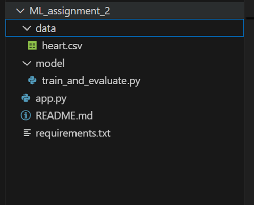

# Machine Learning Assignment – 2

**Course:** Machine Learning  
**Programme:** M.Tech (AIML)  
**Student Name:** VIGNESH K  
**ID:** 2025ab05306

---

## a. Problem Statement

The objective of this assignment is to implement multiple machine learning classification models, evaluate their performance using standard metrics, and deploy the models using an interactive Streamlit web application. The assignment demonstrates an end-to-end machine learning workflow, including:

- Dataset selection
- Model implementation
- Model evaluation
- User interface development
- Cloud deployment using Streamlit Community Cloud

---

## b. Dataset Description

- **Dataset Name:** Heart Disease Dataset
- **Source:** Public dataset from Kaggle
- **Problem Type:** Binary Classification
- **Target Variable:** Presence of heart disease (0 = No, 1 = Yes)
- **Number of Features:** ≥ 12
- **Number of Instances:** ≥ 500

The dataset consists of patient health-related attributes such as age, cholesterol level, blood pressure, and other clinical parameters used to predict the presence of heart disease.

---

## c. Models Used and Evaluation Metrics

The following six classification models were implemented using the same dataset:

1. Logistic Regression
2. Decision Tree Classifier
3. K-Nearest Neighbors (KNN)
4. Naive Bayes Classifier
5. Random Forest (Ensemble Model)
6. XGBoost (Ensemble Model)

---

## d. Evaluation Metrics Used

For each model, the following metrics were calculated:

- Accuracy
- AUC Score
- Precision
- Recall
- F1 Score
- Matthews Correlation Coefficient (MCC)

---

## e. Model Performance Comparison Table

| ML Model | Accuracy | Precision | Recall | F1 Score | MCC | AUC |
|:---|:---:|:---:|:---:|:---:|:---:|:---:|
| Logistic Regression | 0.7951 | 0.7563 | 0.8737 | 0.8108 | 0.5972 | 0.8787 |
| Decision Tree | 0.9853 | 1.0000 | 0.9708 | 0.9852 | 0.9711 | 0.9854 |
| KNN | 0.8341 | 0.8000 | 0.8932 | 0.8440 | 0.6727 | 0.9485 |
| Naive Bayes | 0.8000 | 0.7540 | 0.8932 | 0.8177 | 0.6102 | 0.8705 |
| Random Forest (Ensemble) | 0.9853 | 1.0000 | 0.9708 | 0.9852 | 0.9711 | 0.9999 |
| XGBoost (Ensemble) | 0.9853 | 1.0000 | 0.9708 | 0.9852 | 0.9711 | 0.9894 |

---

## f. Model-wise Observations

| ML Model | Observation |
|:---|:---|
| Logistic Regression | Performs well as a baseline model with stable and interpretable results. |
| Decision Tree | Captures non-linear relationships but may overfit the dataset. |
| KNN | Sensitive to the choice of K and distance metric; performance varies with data scaling. |
| Naive Bayes | Fast and efficient but assumes feature independence, which may reduce accuracy. |
| Random Forest (Ensemble) | Provides improved performance due to ensemble averaging and reduced overfitting. |
| XGBoost (Ensemble) | Shows competitive performance and strong AUC due to gradient boosting and regularization but slightly underperforms Random Forest on this dataset, likely due to limited hyperparameter tuning. |

---

## g. Streamlit Application Features

The deployed Streamlit application includes the following features:

- CSV dataset download and upload option
- Model selection dropdown
- Display of evaluation metrics
- Confusion matrix visualization

---

## h. Project Structure

---

## i. Deployment Details

- **Platform:** Streamlit Community Cloud
- **Python Version:** 3.10
- **Deployment Type:** Free Tier
- **GitHub Link:** [vigneshk08/ML_assignment_2](https://github.com/vigneshk08/ML_assignment_2)
- **Live App Link:** [Streamlit App](https://your-app-link-here)
